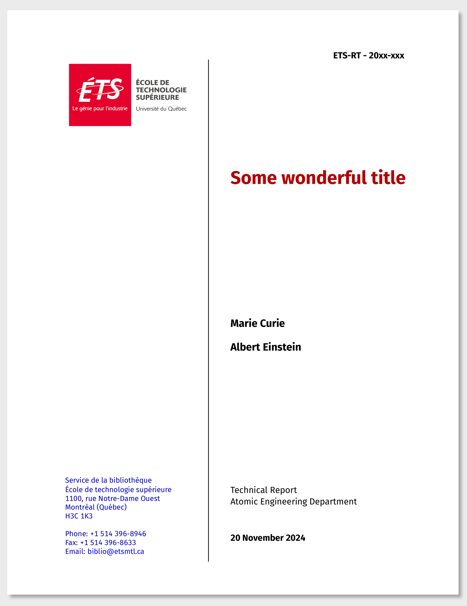

<!-- README.md is generated from README.qmd. Please edit that file -->
<!-- You must have installed R, as well as the R packages tidyverse, quarto, magick -->

# Template for ÉTS Technical Reports

This is a Quarto template that assists you in creating a technical
report for École de technologie supérieure (experimental - not
official).

## Creating a new report

You can use this as a template to create a report. To do this, use the
following command:

``` bash
quarto use template fuhrmanator/ets-report
```

This will install the extension and create an example qmd file that you
can use as a starting place for your report.

## Installation for existing document

You may also use this format with an existing Quarto project or
document. From the quarto project or document directory, run the
following command to install this format:

``` bash
quarto install extension fuhrmanator/ets-report
```

## Example

[](examples/template.pdf)
